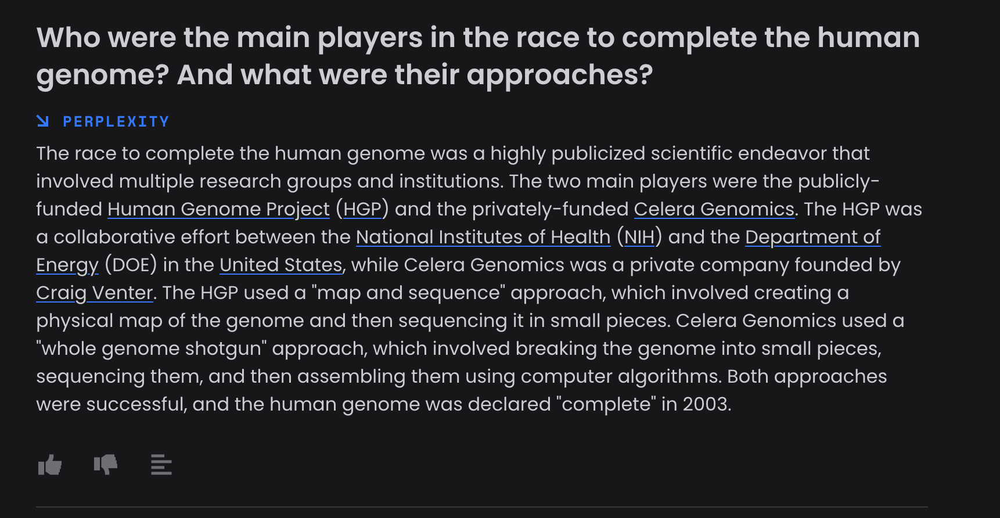
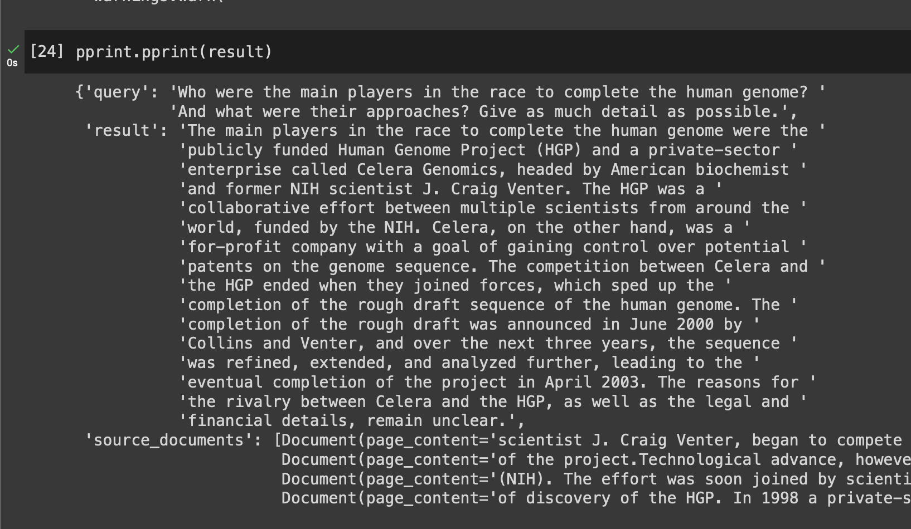

# Simple Perplexity AI clone

Perplexity AI ([perplexity.ai](perplexity.ai)) is an chat tool that uses foundational language models, such as GPT-4 from OpenAI, along with current information from the internet. It not only provides answers, but also references to the sources that contributed to those answers. This simple, yet powerful approach addresses the limitation of potentially outdated training data used to train the models. By returning the sources used to provide an answer, you can verify its accuracy. This combats the issue of language models generating incorrect answers.

This may sound like a major project and a serious undertaking, but modern tools have made it surprisingly easy.

The workflow can be described as followed:

1. The user poses a question.
2. A Google search is performed using the question.
3. The top-k search results, or the most relevant webpages, are downloaded.
4. Raw HTML data is transformed into a usable format by LangChain.
5. All documents are split into 1,000 character chunks.
6. Compute embeddings for each document chunk and store them in a vector store (chromadb).
7. Build a prompt using the user's question from step 1 and all the scraped web data using LangChain.
8. Query an OpenAI model to generate an answer.
9. Identify the documents that contributed to the answer and return them as references.

If you have any questions, feel free to reach out to me on [Twitter](http://twitter.com/marcusklarqvist).

## Example result comparison

**Prompt**: Who were the main players in the race to complete the human genome? And what were their approaches?

Perplexity response:

Clone response:
